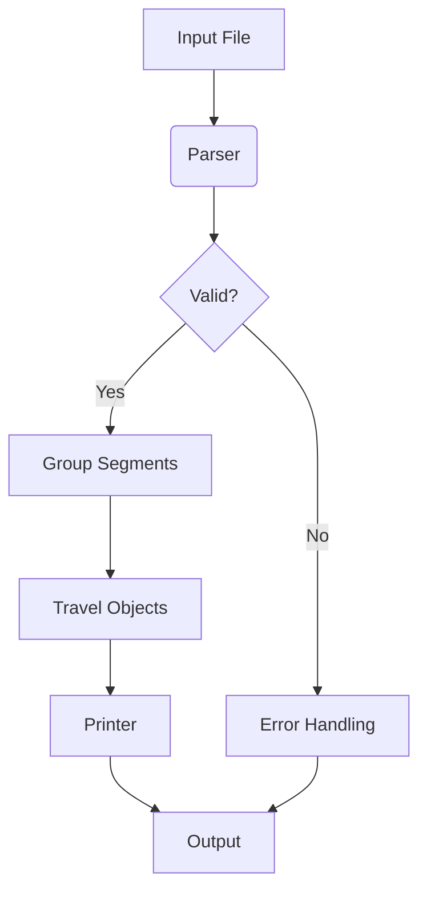
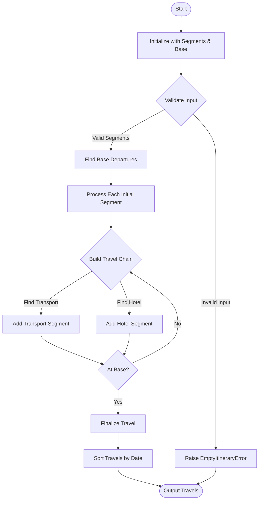
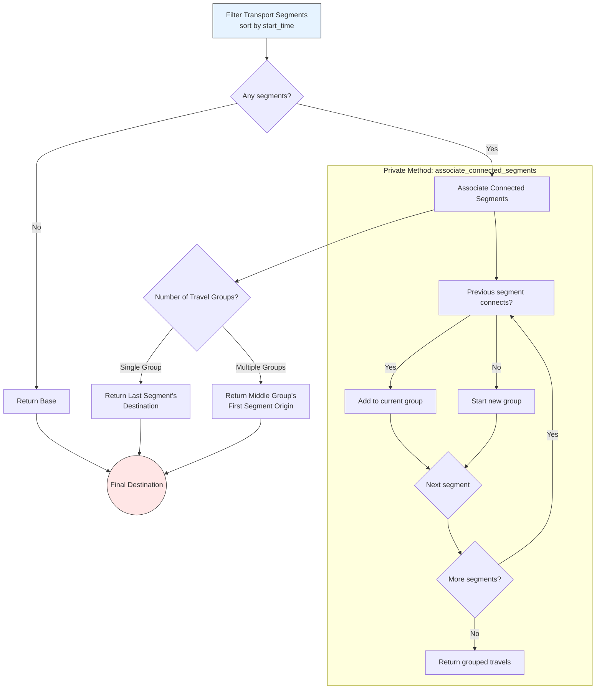

# FCM Technical Challenge Solution

## Introduction

Hey, welcome reviewer, thanks for your precious time and I hope this document helps you to understand any further decision I take.

First of all, I'm a docker first developer, I always use and develop with Docker, you'll need to have docker available and running on your side to have a successful execution of the make run

I usually have a Makefile for some quick commands that are required daily.
I'm used to rebase and reorder all commits, but for the sake of being clear on all the steps I performed, I would just do it in case there's two consecutive commits that are related.

## Problem Analysis

### Problem Statement

Transform raw travel reservation data into organized trips grouped by destination, maintaining chronological order and considering 24-hour connections as part of the same trip.

### Key Inputs/Outputs

- **Input**: Text file with `RESERVATION` blocks containing flights, hotels, and trains
- **Output**: Grouped trips with formatted chronological segments
- **Constraints**:
  - IATA codes (3-letter capitals)
    - It will be enforced at repository level
  - Non-overlapping segments
  - 24-hour connection threshold

### Edge Cases

- Overnight segments crossing midnight
- One segment trips (Hotel or Transport)
- One-way trips
- Multiple trips to same destination
- Malformed input lines
- Empty input files

## Solution Design

### Algorithm

1. **Parse Segments**: Extract segments into structured objects.
2. **Group Trips**:
   - Start with base (SVQ) departure.
   - Add subsequent segments until return to base or 24h+ gap.
   - Include hotels within trip timeframe.
3. **Sort**: Trips by start time; segments in insertion order.
4. **Output**: Generate a proper output as required.

### Architectural Patterns

#### Hexagonal Architecture

```shell
                +----------------+
                |    Use Cases   |
                | (GroupSegments)|
                +-------+--------+
                        |
           +------------+------------+
           |                         |
+----------v----------+    +----------v----------+
|   Core Entities     |    |   Ports/Adapters    |
| (Travel, Flight...) |    | (Repositories,      |
+---------------------+    |  Printers)          |
                           +---------------------+
```

- **Core**: Business logic isolation
  - Entities (`Flight`, `Hotel`, `Travel`)
  - Use Cases (`GroupSegments`)
  - Interfaces (`SegmentRepository`)
- **Adapters**: Swappable I/O components
  - `TextFileSegmentRepository`, `TextSegmentPrinter`

#### Applying the SOLID Principles

1. **Single Responsibility**: Each class handles one task (e.g., parsing, grouping)
2. **Open/Closed**: Extensible via new adapters (e.g., JSON repository)
3. **Liskov**: Uniform transport interfaces
4. **Interface Segregation**: Narrow printer/repo contracts
5. **Dependency Inversion**: Core depends on abstractions, Repository passed to use cases

## Implementation Plan

### Folder Structure

```shell
├── core/               # Business logic
│   ├── entities/       # Flight.rb, Hotel.rb, Travel.rb...
│   ├── ports/          # Adapters interfaces
│   └── use_cases/      # Use Case Services
├── adapters/           # I/O implementations
│   ├── repositories/   # Input File Repository
│   ├── loggers/        # Logger adapters
│   └── printers/       # Output to console
├── config/             # Project configuration
├── spec/               # RSpec tests
```

### Phases

1. **Containerization**
   - Docker setup
2. **Create and set all tooling (rspec/rubocop)**
   - Set the foundations of the dev environment to speed up the next steps and allow TDD.
3. **Implement DTO/Entities**
   - Create all required entities identified (Flight/Hotel/Train/Travel/Segment).
   - Set validation and time handling helpers.
4. **Adapter Development**
   - Text parser/printer, error handling.
5. **Develop Grouping feature**
   - To code the main logic using the previous components.
6. **Resilience Engineering**
   - Implement retry logic, exception handling, or any other mechanism to ensure it has a successful result.
   - Add Zeitwerk, in order to make easier to autoload and eager load the project.
7. **Quality Automation**
   - Coverage checks, CI/CD integration & Git Hooks.

### Tools

- Ruby 3.4.0
- RSpec/SimpleCov (testing)
- Docker (containerization)
- Rubycritic (statis code analysis)
- Zeitwerk (auto loading)

## Testing Strategy

### Test Cases

1. **Parsing**:
   - Valid/invalid segment lines
   - Overnight flight parsing
2. **Grouping**:
   - Single-flight trip
   - Multi-segment trip with hotel
   - 24h connection handling
3. **Edge Cases**:
   - Empty input file
   - Segments with invalid dates

### Test Pyramid

1. **Unit Tests**
   - Entity validation
   - Parser edge cases
2. **Integration Tests**
   - Full trip grouping
   - Error recovery paths
3. **Quality Gates**:
    Implement Git hooks -> Block commits if coverage <90%

## Challenges & Assumptions

### Security

- Non-root Docker user
- Dependency audits
- Containerised environment
- Safe parsing

### Possible improvements

- Timezone handling for international trips
- New Sources (e.g. PDF/Email parsers)
- Parse, gather information, and validate the IATA codes-
  - Add a new entity:
- Extensible to new segment types (e.g. CarRental) via new entities
- Repository pattern allows easy DB/API integration
- Printer can be swapped for HTML/JSON output

### Assumptions

- All times in local timezone
- No overlapping segments (per spec)

### Workflow Diagram

**Main logic flow:**



**Trip itinerary logic:**



**Destination calculation:**


